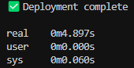
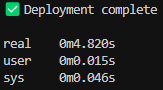
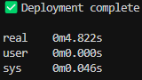
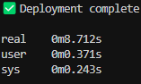
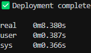
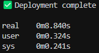

# 🐳 Docker Deploy Action (Go)

[](https://github.com/alcharra/docker-deploy-action-go/actions/workflows/test.yml)
[](https://github.com/alcharra/docker-deploy-action-go/releases)
[](https://golang.org/)

A **reliable and efficient GitHub Action** written in Go for deploying **Docker Compose** and **Docker Swarm** services over SSH.

This action securely **uploads deployment files**, prepares the **remote environment** and automatically **provisions Docker networks** if needed. It supports **health checks, rollback** and optional **resource cleanup**, ensuring smooth and stable deployments with minimal hassle.

## Performance Comparison

The Go-based deployment tool was built with speed in mind — here’s a real-world comparison against the original [PowerShell/Bash-based version](https://github.com/alcharra/docker-deploy-action).

### Test Details

Both tools were tested under identical conditions: a Docker Compose deployment using the same configuration file along with three additional files (~1KB each). The tests were run on the same server, using the same SSH key, network and project path, ensuring a fair comparison between the two implementations. 

### Results

| Tool            | Average Time | Fastest Time | Slowest Time |
|-----------------|--------------|--------------|--------------|
| PowerShell/Bash | ~8.64s       | 8.38s        | 8.84s        |
| Go              | ~4.85s       | 4.82s        | 4.90s        |

✅ **Result:** The Go version is consistently **~44% faster** on average.

This speed gain comes from running a single compiled binary without shell overhead, resulting in faster deployments, especially in CI environments.

<details>
<summary>📸 See test outputs</summary>

| Go Version  | Output                        |
|-------------|-------------------------------|
|  |
|  |
|  |

| PowerShell/Bash | Output                            |
|-----------------|-----------------------------------|
|  |
|  |
|  |

</details>

## Inputs

|  Input Parameter            |  Description                                                               | Required     | Default Value        |
| -------------------------   | -------------------------------------------------------------------------- | :----------: | -------------------- |
| `ssh_host`                  |  Hostname or IP of the target server                                       | ✅          |                      |
| `ssh_port`                  |  SSH port                                                                  | ❌          | `22`                 |
| `ssh_user`                  |  SSH username                                                              | ✅          |                      |
| `ssh_key`                   |  SSH private key                                                           | ✅          |                      |
| `project_path`              |  Path on the server where files will be uploaded                           | ✅          |                      |
| `deploy_file`               |  Path to the Docker Compose or Stack file used for deployment              | ✅          | `docker-compose.yml` |
| `extra_files`               |  Additional files to upload (e.g., `.env`, config files)                   | ❌          |                      |
| `mode`                      |  Deployment mode (`compose` or `stack`)                                    | ❌          | `compose`            |
| `stack_name`                |  Swarm stack name (only used if `mode` is `stack`)                         | ❌          |                      |
| `docker_network`            |  Docker network name to ensure exists                                      | ❌          |                      |
| `docker_network_driver`     |  Network driver (`bridge`, `overlay`, `macvlan`, etc.)                     | ❌          | `bridge`             |
| `docker_network_attachable` |  Allow standalone containers to attach to the Swarm network (`true/false`) | ❌          | `false`              |
| `docker_prune`              |  Type of Docker prune to run after deployment                              | ❌          |                      |
| `registry_host`             |  Registry Authentication Host                                              | ❌          |                      |
| `registry_user`             |  Registry Authentication User                                              | ❌          |                      |
| `registry_pass`             |  Registry Authentication Pass                                              | ❌          |                      |
| `enable_rollback`           |  Enable automatic rollback if deployment fails (`true/false`)              | ❌          | `false`              |

## Supported Prune Types

- `none` – No pruning (default)
- `system` – Remove unused images, containers, volumes and networks
- `volumes` – Remove unused volumes
- `networks` – Remove unused networks
- `images` – Remove unused images
- `containers` – Remove stopped containers

## Network Management

This action ensures the required Docker network exists before deploying. If it is missing, it will be created automatically using the specified driver.

### How it works

- If the network already exists, its driver is verified.
- If the network does not exist, it is created using the provided driver.
- If `docker_network_attachable` is set to `true`, the network is created with the `--attachable` flag.
- In `stack` mode with the `overlay` driver:
  - Swarm mode must be active on the target server.
  - A warning is displayed if Swarm is not active.
- If the existing network uses a different driver than specified, a warning is displayed.

### Network scenarios

A network will be created if:
- The specified network does not exist.
- A custom network is defined via `docker_network`.
- The provided driver is valid and supported.

Warnings will be displayed if:
- The existing network's driver does not match the one specified.
- Swarm mode is inactive but `overlay` is requested in `stack` mode.

### Example usage

```yaml
docker_network: my_network
docker_network_driver: overlay
docker_network_attachable: true
```

## Rollback Behaviour

This action supports automatic rollback if a deployment fails to start correctly.

### How it works

- In `stack` mode:
  - Docker Swarm’s built-in rollback is used.
  - The command `docker service update --rollback <service-name>` is run to revert services in the stack to the last working state.

- In `compose` mode:
  - A backup of the current deployment file is created before deployment.
  - If services fail to start, the backup is restored and Compose is re-deployed.
  - If rollback is successful, the backup file is removed to avoid stale data.

### Rollback triggers

Rollback will occur if:
- Services fail health checks.
- Containers immediately exit after starting.
- Docker returns an error during service startup.

Rollback will not occur if:
- The deployment succeeds but the application has internal errors.
- A service is manually stopped by the user.
- Rollback is disabled via `enable_rollback: false`.

## Example Workflow

```yaml
name: Deploy

on:
  push:
    branches:
      - main

jobs:
  deploy:
    runs-on: ubuntu-latest

    steps:
      - name: Checkout code
        uses: actions/checkout@v4

      # Example 1: Deploy to Docker Swarm
      - name: Deploy to Docker Swarm
        uses: alcharra/docker-deploy-action-go@v1
        with:
          ssh_host: ${{ secrets.SSH_HOST }}
          ssh_user: ${{ secrets.SSH_USER }}
          ssh_key: ${{ secrets.SSH_KEY }}
          project_path: /opt/myapp
          deploy_file: docker-stack.yml
          extra_files: .env,traefik.yml
          mode: stack
          stack_name: myapp
          docker_network: myapp_network
          docker_network_driver: overlay
          docker_prune: system
          registry_host: ghcr.io
          registry_user: ${{ github.actor }}
          registry_pass: ${{ secrets.GITHUB_TOKEN }}

      # Example 2: Deploy using Docker Compose
      - name: Deploy using Docker Compose
        uses: alcharra/docker-deploy-action-go@v1
        with:
          ssh_host: ${{ secrets.SSH_HOST }}
          ssh_user: ${{ secrets.SSH_USER }}
          ssh_key: ${{ secrets.SSH_KEY }}
          project_path: /opt/myapp
          deploy_file: docker-compose.yml
          extra_files: .env,database.env,nginx.conf  
          mode: compose
          docker_network: myapp_network
          docker_network_driver: bridge
          docker_prune: system
          registry_host: docker.io
          registry_user: ${{ secrets.DOCKER_USERNAME }}
          registry_pass: ${{ secrets.DOCKER_PASSWORD }}
```

## Requirements on the Server

- Docker must be installed
- Docker Compose (if using `compose` mode)
- Docker Swarm must be initialised (if using `stack` mode)
- SSH access must be configured for the provided user and key

## Important Notes

- This action is designed for Linux servers (Debian, Ubuntu, Alpine, CentOS)
- The SSH user must have permissions to write files and run Docker commands
- If the `project_path` does not exist, it will be created with permissions `750` and owned by the provided SSH user
- If using Swarm mode, the target machine must be a Swarm manager

## References

- [Docker Compose Documentation](https://docs.docker.com/compose/)
- [Docker Swarm Documentation](https://docs.docker.com/engine/swarm/)
- [Docker Prune Documentation](https://docs.docker.com/config/pruning/)
- [Docker Documentation](https://docs.docker.com/network/)

## Tips for Maintainers

- Test the full process locally before using in GitHub Actions
- Always use GitHub Secrets for sensitive values like SSH keys
- Make sure firewall rules allow SSH access from GitHub runners

## Contributing

Contributions are welcome. If you would like to improve this action, please feel free to open a pull request or raise an issue. We appreciate your input.

## License

This project is licensed under the [MIT License](LICENSE).